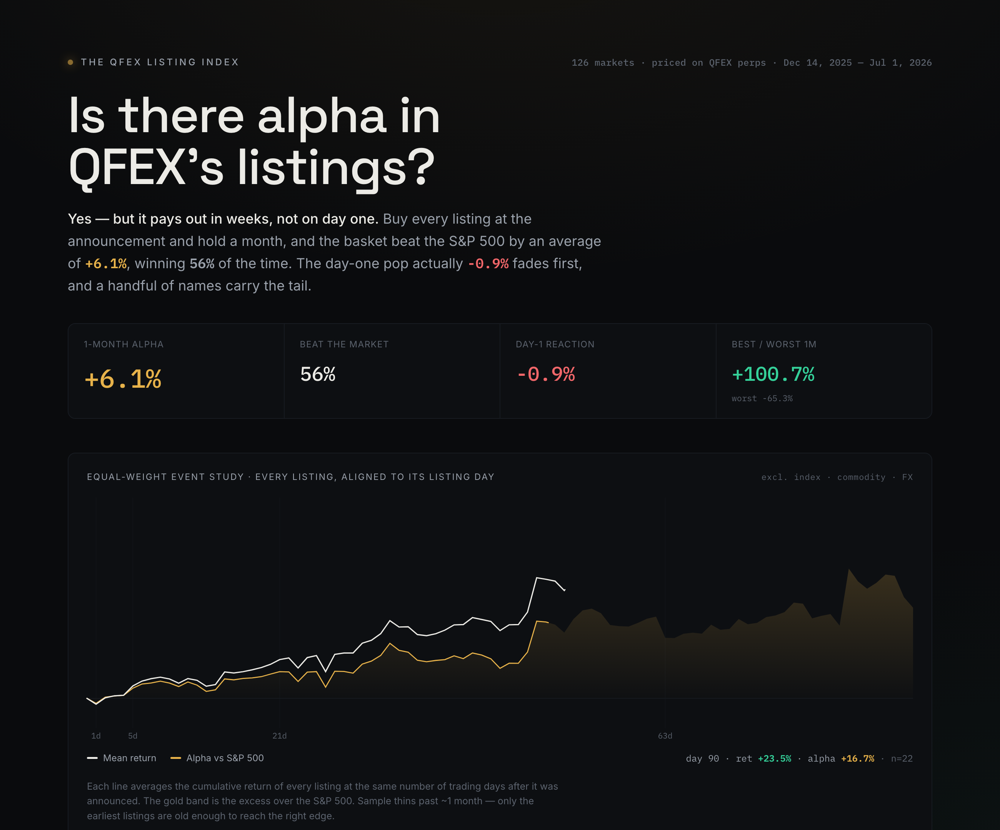

# The QFEX Listing Index

> *"Somebody should make an index of QFEX's previous listings and their performance…"*

Here it is. Every asset [QFEX](https://x.com/qfex) has announced as a new listing on X,
sourced to the announcing tweet, priced against real market data, and measured for
**alpha** — does buying the listing at the announcement beat the market?



## The answer

Priced on **QFEX's own perp candles** across **126 markets** (launches Dec 2025 – Jul 2026),
buying every listing at its launch and holding shows a **right-skewed edge that shows up in
weeks, not on day one**:

| Horizon | Mean return | Mean alpha vs S&P 500 | Beat-rate | t-stat |
|---------|------------|-----------------------|-----------|--------|
| 1 day   | −1.0%      | **−1.0%**             | 40%       | **−2.2** |
| 1 week  | +2.9%      | +2.3%                 | 48%       | 1.8    |
| 1 month | +7.1%      | **+4.6%**             | 53%       | 1.7    |
| 3 month | +17%       | +11.8% (median ≈ 0)   | 42%       | 1.2    |

*(All 126 markets, priced on QFEX perps, benchmarked against the S&P 500.)*

**Reading it honestly:** the day-one reaction is *significantly negative* (t ≈ −2.2 — a real
"sell the news"). The edge then builds to **~+4.6% alpha by one month** (t ≈ 1.7, shy of
significance). By three months the *mean* alpha is large but the *median* is roughly flat —
a few monster winners carry the basket while the typical listing lags. A real but lopsided
edge, not a printing press.

Because QFEX perps trade 24/7 and settle in USD, this measures the actual P&L a QFEX trader
would have booked — not a proxy from another venue.

## Architecture

```
qfex_listing/
├── qfex_xposts_*.csv          # 154 QFEX tweets (announcement source)
├── backend/
│   ├── qfex.py                # QFEX API client: refdata (126 markets) + daily candles
│   ├── extract_workflow.js    # dynamic multi-agent workflow that classified the tweets
│   ├── listings.json          # curated tweet→ticker map (used for source provenance)
│   ├── pipeline.py            # build index from QFEX prices; also a streaming generator
│   ├── app.py                 # FastAPI: /api/index, /api/listing/{t}, /api/sync/stream (SSE)
│   ├── cnbc.py                # (legacy) CNBC fetcher from the first pass
│   ├── qfex_cache/            # cached refdata + candles (gitignored)
│   └── data/index.json        # computed index (gitignored — regenerable)
└── frontend/                  # Vite + React + TS + framer-motion
    └── src/                    #   quant-tearsheet UI; hand-rolled SVG charts; live sync
```

### Data source — QFEX itself
The authoritative source is the **QFEX exchange API** (`api.qfex.com`, public, no auth):
- `GET /refdata` → every listed market (126: 104 equities, 13 indices/ETFs, 6 commodities, 3 FX).
- `GET /candles/{symbol}?resolution=1DAY&fromISO=…&toISO=…` → the market's own perp OHLCV.
  The **first candle is the true launch date** — more precise than the tweet.

Each market is matched back to its announcing tweet (from the workflow's `listings.json`)
where one exists — 95 of 126 have one; the rest (e.g. AAPL, NVDA, listed before the tweet
window) are sourced directly from QFEX and badged `QFEX`. Benchmark is QFEX's own S&P 500
perp, `US500-USD`, so it's an apples-to-apples 24/7 comparison.

### Live sync with download progress (fetch-once + resumable)
`GET /api/sync/stream` (SSE) builds from QFEX, emitting per-market progress. **Data is
fetched once**: each symbol's candles are cached to its own file, so symbols already on
disk are reused and only missing ones hit the network. An interrupted download therefore
**resumes** — re-running fetches only what's left. `?force=true` re-downloads everything to
refresh prices.

The frontend **Sync from QFEX** button opens a progress overlay — a bar, a `N / 126`
counter, the current symbol, a live tape (with `cached` tags), and a **Resume** button if
the stream drops. The initial page load streams `/api/index` with a real byte-progress bar.

### Benchmark coverage
The benchmark is QFEX's own `US500-USD` perp, extended backward with the real S&P 500 index
(chained at the join date) so that markets listed before `US500-USD` launched (Dec 2025 –
Feb 2026) still get an alpha. Markets too young for a horizon show their **return so far**
(muted, with a `Nd` days-live marker) rather than a blank — the aggregate stats still only
count markets that have actually reached the horizon.

### How listings were extracted
The tweets mix real listings with feature announcements, marketing follow-ups, basket
re-lists, and off-topic posts. A **dynamic workflow** (`extract_workflow.js`) fans out 8
parallel agents to classify each tweet and resolve every ticker to a **CNBC price symbol
verified live** (each agent curls the CNBC endpoint and confirms real bars come back),
then a reconcile pass dedupes to each asset's earliest listing date. Result: 95 listings,
all price-verified; 2 correctly excluded ("$IBM getting listed soon", a partial-close
feature announcement).

### Data source
[CNBC](https://www.cnbc.com) daily OHLC bars — universal across US & Korean equities,
ETFs, indices (`.SPX`, `.TWII`, `.HSI`, `.N225`), and commodity futures (`@CL.1`, `@NG.1`,
`@SI.1`). Raw bars are cached under `backend/prices/` (gitignored). *(Yahoo Finance was
rate-limited and Stooq now serves a JS challenge, so CNBC is the backbone.)*

### Methodology
- **Entry** = the first QFEX candle close (the market's launch price on QFEX).
- **Horizons** in *calendar days* (1 / 7 / 30 / 90) plus "since listing" — QFEX perps trade
  24/7, so the daily series is continuous with no trading-day gaps to reconcile.
- **Alpha** = listing return − `US500-USD` return over the *identical* window.
- **Event study** = equal-weight cumulative-average return of every equity listing aligned
  to its own launch day (the hero chart). Sample thins past ~1 month — only the earliest
  listings are old enough to reach the right edge, so the tail is noisier.

## Running it

```bash
./run.sh            # installs deps, builds the index, starts API + frontend
# then open http://localhost:5173
REFRESH=1 ./run.sh  # re-fetch prices and rebuild
```

Or manually:
```bash
cd backend && pip install -r requirements.txt && python3 pipeline.py
python3 -m uvicorn app:app --port 8000
cd ../frontend && npm install && npm run dev
```

### Regenerating the listing extraction
`backend/listings.json` is committed. To rebuild it from the tweets, re-run the workflow
(`extract_workflow.js`) via the Claude Code Workflow tool, then `python3 pipeline.py`.

## Notes
- URL deep-links: `?listing=AMD` opens a listing's detail; `?still=1` disables entrance
  animations (used for static capture / honored automatically under reduced-motion).
- Not investment advice. Past performance ≠ future results. Data is point-in-time.
